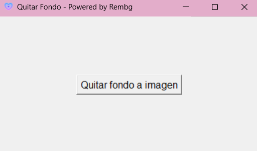

# 🧼 Background Remover – Python Desktop App

Hi there! This is a lightweight desktop application built with Python to easily remove the background from any image using the amazing [`rembg`](https://github.com/danielgatis/rembg) library. It features a simple -PRETTY SIMPLE- GUI built with `tkinter`, custom icon, and a splash screen ✨

---

## 🪄 Features

- Selects images in `.png`, `.jpg`, `.jpeg`, `.webp`, or `.bmp`
- Automatically removes the background
- Saves the output image with a transparent background
- Built with love 💜 

---

## 🖼 Screenshots

### 🌸 Main Window:



### ✨ Output example:


---

## 🚀 How to Use

### 1. Clone the repository

```bash
git clone https://github.com/milagrosmirusta/remove-background.git
cd remove-background
```

### 2. Install dependencies

```bash
pip install rembg
```

### 3. Run the app

```bash
python quitar_fondo.py
```


## 🧾 Build your own .exe file (Windows)

```bash
pyinstaller --clean --onefile --noconsole --icon=removebg.ico --add-data "removebg.ico;." quitar_fondo.py
```
This will create a .exe in the dist/ folder.


#### Credits
Created with 🩷 by @milagrosmirusta

Powered by:  
`rembg`  
`tkinter`  
`pyinstaller`  